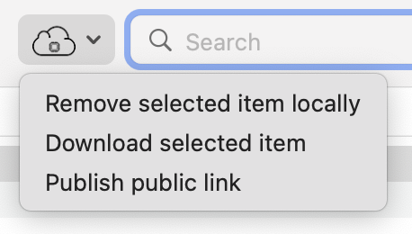

# iCloud Control

Adds a menu to the Finder that allows control over files stored in iCloud, allowing user-controlled selective synchronisation.

## Now updated for Apple silicon!
Version 1.3 of iCloud Control allows for native execution on Macs based on Apple silicon. This new version also provides support for Swift 5.

## Installation

- [Download the latest version here](https://github.com/Njmcq/iCloud-Control/releases)
- Place the app in your Applications folder
- Launch it by right/control clicking and choosing "Open" (to prevent Gatekeeper from preventing the app to open) and follow the instructions on screen

## Usage

The following options are provided through a toolbar item in the Finder.

- **Remove selected item locally**: the selected item(s) will be removed from your device, while remaining in iCloud.
- **Download selected item**: download previously removed files from iCloud.
- **Publish public link**: places a link to the selected file in your clipboard.
- **Exclude selected item from iCloud**: using the .nosync file extension, files in an iCloud-based directory will not sync with the service.

While Apple incorporated similar functionality into macOS 10.15 Catalina, the native method does not allow for removing local selected items in bulk if the mass selection includes files already removed.

iCloud Control solves this, and allows for the removal of a selection of files even if already-removed files exist.

## Compatibility

iCloud Control 1.3 is compatible with macOS 10.13 and above. Users who wish to use iCloud Control on 10.12 or below may do so with version 1.2 published by @Obbut, found at https://github.com/Obbut/iCloud-Control/releases

## License

iCloud Control is licensed under the MIT license. In addition to the restrictions placed by the MIT license, **you are not permitted and will not get permission to list iCloud Control or any derivative work on software catalogue websites like Mac Informer or MacUpdate.**

The MIT License (MIT)

Copyright (c) 2016 Robbert Brandsma; (c) 2022 Nick McQuade

Permission is hereby granted, free of charge, to any person obtaining a copy of this software and associated documentation files (the "Software"), to deal in the Software without restriction, including without limitation the rights to use, copy, modify, merge, publish, distribute, sublicense, and/or sell copies of the Software, and to permit persons to whom the Software is furnished to do so, subject to the following conditions:

The above copyright notice and this permission notice shall be included in all copies or substantial portions of the Software.

THE SOFTWARE IS PROVIDED "AS IS", WITHOUT WARRANTY OF ANY KIND, EXPRESS OR IMPLIED, INCLUDING BUT NOT LIMITED TO THE WARRANTIES OF MERCHANTABILITY, FITNESS FOR A PARTICULAR PURPOSE AND NONINFRINGEMENT. IN NO EVENT SHALL THE AUTHORS OR COPYRIGHT HOLDERS BE LIABLE FOR ANY CLAIM, DAMAGES OR OTHER LIABILITY, WHETHER IN AN ACTION OF CONTRACT, TORT OR OTHERWISE, ARISING FROM, OUT OF OR IN CONNECTION WITH THE SOFTWARE OR THE USE OR OTHER DEALINGS IN THE SOFTWARE.
