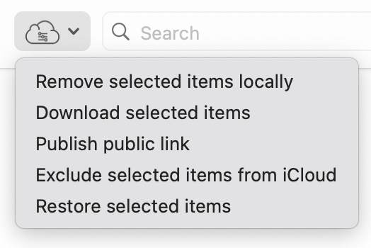
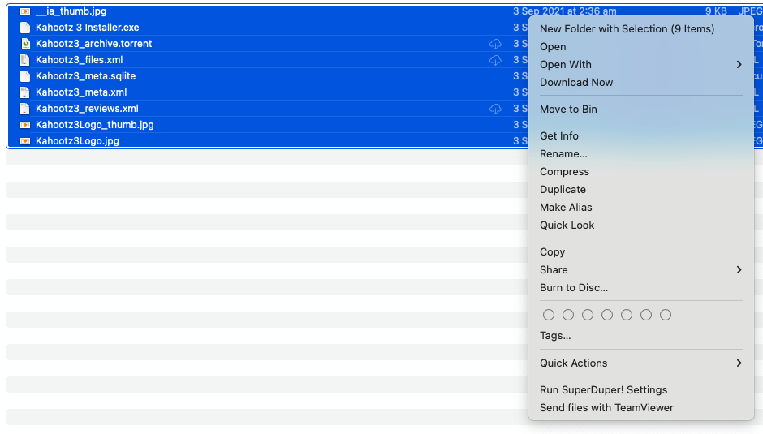

# iCloud Control

Adds a menu to the Finder that allows control over files stored in iCloud, allowing user-controlled selective synchronisation.

## Now updated for Apple silicon!
In version 1.3 and above, iCloud Control allows for native execution on Macs based on Apple silicon, with every release built as a Universal binary. These updates also add support for Swift 5.

## Installation & Help

1. Download the latest version of iCloud Control from the [GitHub releases page](https://github.com/Njmcq/iCloud-Control/releases/latest).
2. Move iCloud Control from your Downloads to the Applications folder.
3. Because iCloud Control doesn't have a valid signature as of yet, Gatekeeper flags the app as unknown. iCloud Control is not in any way malicious, and if you are concerned, you are more than welcome to review the source code in the repository. To bypass Gatekeeper, control-click or right-click on the app in the Applications folder, and select "Open". This will bring up a similar alert, but you will be able to select "Open" to run the app.
4. iCloud Control will open with a window welcoming you! As per the instructions in that window, you need to select Open System Settings (or System Preferences on older versions of macOS) to bring up the Extensions panel.
5. In the panel, select "Added Extensions" and enable iCloud Control's Finder extension (you may have to scroll down if multiple other apps appear here).
6. Once you have done this, you can safely close System Settings/Preferences and the iCloud Control app.
7. Open a Finder window. In the Toolbar at the top, you may see the iCloud Control icon appear. If you don't, control- or right-click the Toolbar and select "Customise Toolbar". A new window will open with a selection of Toolbar extensions. Drag iCloud Control into the Toolbar (the other extensions will be bouncing around). Some may easily confuse the default Toolbar preset at the bottom of the window for the place to drag the extension, so ensure that it's the one which has bouncing icons.
8. Select "Done".

## Usage

The following options are provided through a toolbar item in the Finder.

- **Remove selected item locally**: the selected item(s) will be removed from your device, while remaining in iCloud.
- **Download selected item**: download previously removed files from iCloud.
- **Publish public link**: places a link to the selected file in your clipboard.
- **Exclude selected item from iCloud**: using the .nosync file extension, files in an iCloud-based directory will not sync with the service.
- **Restore selected items**: removes the .nosync extension from files, reverting them to their original file type.

While Apple incorporated similar functionality into macOS 10.15 Catalina, the native method does not allow for removing local selected items in bulk if the mass selection includes files already removed.

iCloud Control solves this, and allows for the removal of a selection of files even if already-removed files exist.

## Compatibility

iCloud Control 1.3 and above is compatible with macOS 10.13 and above. Users who wish to use iCloud Control on 10.12 or below may do so with version 1.2 published by [@Obbut](https://github.com/Obbut), found at https://github.com/Obbut/iCloud-Control/releases

## Known Issues
### Optimise Mac Storage may interfere with iCloud Control's features
**Issue:** If Optimise Mac Storage is enabled in your iCloud settings, it may override some of the operations of iCloud Control (such as reversing "Remove selected items locally".

**Workaround:** Unfortunately, there is no way to easily overcome this issue. As a result, you may have to select the option a couple of times if the file reverts to its original state, to force iCloud Control's operation. Otherwise, if this continues to cause issues, consider disabling Optimise Mac Storage.

If you happen to find any issues while using iCloud Control, please let me know at nick.mcq100@icloud.com.

## License

[View the LICENSE.md file](https://github.com/Njmcq/iCloud-Control/blob/master/LICENSE.md)

MIT License

Copyright (c) 2016 Robbert Brandsma  
Copyright (c) 2022-2023 Nick McQuade

Permission is hereby granted, free of charge, to any person obtaining a copy
of this software and associated documentation files (the "Software"), to deal
in the Software without restriction, including without limitation the rights
to use, copy, modify, merge, publish, distribute, sublicense, and/or sell
copies of the Software, and to permit persons to whom the Software is
furnished to do so, subject to the following conditions:

The above copyright notice and this permission notice shall be included in all
copies or substantial portions of the Software.

THE SOFTWARE IS PROVIDED "AS IS", WITHOUT WARRANTY OF ANY KIND, EXPRESS OR
IMPLIED, INCLUDING BUT NOT LIMITED TO THE WARRANTIES OF MERCHANTABILITY,
FITNESS FOR A PARTICULAR PURPOSE AND NONINFRINGEMENT. IN NO EVENT SHALL THE
AUTHORS OR COPYRIGHT HOLDERS BE LIABLE FOR ANY CLAIM, DAMAGES OR OTHER
LIABILITY, WHETHER IN AN ACTION OF CONTRACT, TORT OR OTHERWISE, ARISING FROM,
OUT OF OR IN CONNECTION WITH THE SOFTWARE OR THE USE OR OTHER DEALINGS IN THE
SOFTWARE.

