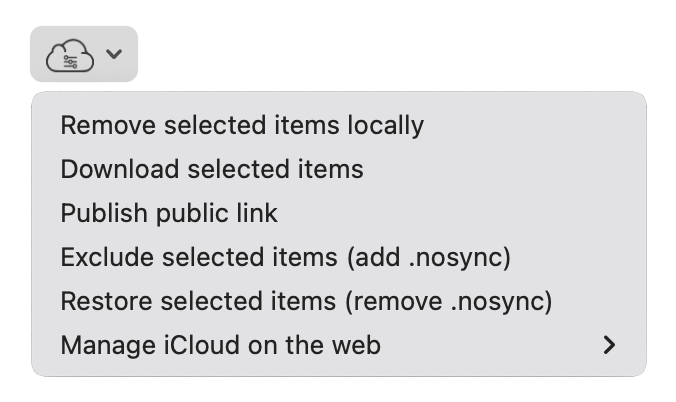

  

---

### Adds a menu to the Finder that allows control over files stored in iCloud Drive, providing user-controlled selective synchronisation.

# :warning: iCloud Control on macOS Sonoma
With the release of macOS Sonoma, iCloud Control's features have become redundant. Now, you can remove partially-downloaded folders by holding the Option key upon Control-clicking the folder, something which wasn't possible in Monterey and Ventura. A small update (1.8.2) will be released in due course to make some minor changes, but this will likely be the final update.

Please refer to the instructions below to learn how to leverage the native Finder functionalities for iCloud file management:

### Remove selected items locally:
This can be accomplished by selecting files/folders in the Finder, Control- or right-clicking the selection, and selecting **Remove Download**. In a selection of files/folders with both local and cloud contents, you can hold the Option key in the menu to bring up the same action.

### Download selected items:
This is available through the same Control- or right-click method as the **Remove selected item locally** option.

### Publish public link:
This can be achieved through the **Share** option on macOS Ventura and later, and the **Share File** option in macOS Monterey and older, through the Control-click menu.

#### In macOS Ventura and later:
> Select **Collaborate** from the menu, and choose **Anyone with the link can edit** below it (this is a little difficult to see, but it should bring up additional sharing options. Choose **Anyone with the link** and manage permissions as you wish. Then select **Invite with Link** in the Sharing options. This will copy the public link to your clipboard.

#### In macOS Monterey and earlier:
> Once **Share File** has been selected, a new window will appear. Select **Copy Link**, and adjust the settings to **Anyone with the link can edit**. Manage your preferred permission settings and press **Share** when you are done. This will copy the public link to your clipboard.

### Exclude selected items from iCloud:
Go to the Finder item in the menu bar, and select Settings (or Preferences on older versions of macOS). In the Advanced panel, enable **Show all filename extensions**. Then, with the files you wish to exclude, go to rename the file and add **.nosync** to the end of the filename.

### Restore selected items:
Simply remove **.nosync** from the filename. Make sure to retain the original file type extension.

## Installation & Help

1. Download the latest version of iCloud Control from the [GitHub releases page](https://github.com/Njmcq/iCloud-Control/releases/latest).
2. Move iCloud Control from your Downloads to the Applications folder.
3. When iCloud Control first opens, you may be prompted to enable notifications. It is highly recommended to enable notifications as they deliver important alerts when using the **Publish public link** feature, and if an error occurs.
> **Note**
> Notifications are currently not available for macOS 10.13.
4. iCloud Control will open with a window welcoming you! As per the instructions in that window, you need to select Open System Settings (or System Preferences on older versions of macOS) to bring up the Extensions panel.
5. In the panel, select "Added Extensions" and enable iCloud Control's Finder extension (you may have to scroll down if multiple other apps appear here).
6. Once you have done this, you can safely close System Settings/Preferences and the iCloud Control app.
7. Open a Finder window. In the Toolbar at the top, you may see the iCloud Control icon appear. If you don't, control- or right-click the Toolbar and select "Customise Toolbar". A new window will open with a selection of Toolbar extensions. Drag iCloud Control into the Toolbar (the other extensions will be bouncing around). Some may easily confuse the default Toolbar preset at the bottom of the window for the place to drag the extension, so ensure that it's the one which has bouncing icons.
8. Select "Done".

### Having issues with the Toolbar extension?
In some circumstances, particularly if you are running macOS 10.13 or have multiple versions of iCloud Control stored on your Mac, you may find that the Toolbar extension and its menus do not display correctly, or will be missing entirely. To resolve the issue, open the Apple menu and log out. You can then log back in and try again. Alternatively, restarting the Mac is basically a guaranteed solution.

## Usage

The following actions are provided through a toolbar item in the Finder:

- **Remove selected items locally**: the selected item(s) will be removed from your device, while remaining in iCloud.
- **Download selected items**: download previously removed files from iCloud.
- **Publish public link**: places a link to the selected file in your clipboard.
- **Exclude selected items**: using the .nosync file extension, files in an iCloud-based directory will not sync with the service.
- **Restore selected items**: removes the .nosync extension from files, reverting them to their original file type.
- **Manage iCloud on the web**: includes quick links to both iCloud.com, appleid.apple.com, and privacy.apple.com.

## Compatibility
iCloud Control 1.3.0 and above is compatible with macOS 10.13 and above, and runs natively on both Intel and Apple silicon Macs. Users who wish to use iCloud Control on 10.12 or below may do so with version 1.2.0 published by [@Obbut](https://github.com/Obbut), found at https://github.com/Obbut/iCloud-Control/releases

## License

[View the LICENSE.md file](https://github.com/Njmcq/iCloud-Control/blob/master/LICENSE.md)

MIT License

Copyright (c) 2016 Robbert Brandsma  
Copyright (c) 2022-2023 Nick McQuade

Permission is hereby granted, free of charge, to any person obtaining a copy
of this software and associated documentation files (the "Software"), to deal
in the Software without restriction, including without limitation the rights
to use, copy, modify, merge, publish, distribute, sublicense, and/or sell
copies of the Software, and to permit persons to whom the Software is
furnished to do so, subject to the following conditions:

The above copyright notice and this permission notice shall be included in all
copies or substantial portions of the Software.

THE SOFTWARE IS PROVIDED "AS IS", WITHOUT WARRANTY OF ANY KIND, EXPRESS OR
IMPLIED, INCLUDING BUT NOT LIMITED TO THE WARRANTIES OF MERCHANTABILITY,
FITNESS FOR A PARTICULAR PURPOSE AND NONINFRINGEMENT. IN NO EVENT SHALL THE
AUTHORS OR COPYRIGHT HOLDERS BE LIABLE FOR ANY CLAIM, DAMAGES OR OTHER
LIABILITY, WHETHER IN AN ACTION OF CONTRACT, TORT OR OTHERWISE, ARISING FROM,
OUT OF OR IN CONNECTION WITH THE SOFTWARE OR THE USE OR OTHER DEALINGS IN THE
SOFTWARE.
